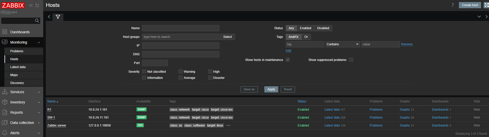

# Zabbix Installation -- LAB-SRV1

> **Device:** lab-srv1 (Ubuntu 26.04 LTS)
> **Zabbix Version:** 7.0.22 (with Zabbix 6.0 LTS repository)
> **Database:** MySQL (MariaDB 11.8.6)
> **Installation Date:** 2026-05-18
> **Installed By:** Admin with AI-Agent

---


## Overview

Zabbix is an enterprise-grade network monitoring solution used to monitor the health and performance of network devices, servers, and services. In the Network Foundry lab, Zabbix monitors Cisco switches, routers, and the Ubuntu server.

**Access:**
- URL: `http://10.0.24.10/zabbix`
- Username: `Admin`
- Password: `[REDACTED]`

---

## Installation Steps

### Step 1: Add Zabbix Repository

```bash
wget -q https://repo.zabbix.com/zabbix/6.0/ubuntu/pool/main/z/zabbix-release/zabbix-release_6.0-6+ubuntu24.04_all.deb
sudo dpkg -i zabbix-release_6.0-6+ubuntu24.04_all.deb
sudo apt update
```

### Step 2: Install Zabbix Packages

```bash
sudo apt install -y zabbix-server-mysql zabbix-frontend-php zabbix-apache-conf zabbix-agent mariadb-server
```

### Step 3: Create Zabbix Database

```bash
sudo mysql -e "CREATE DATABASE zabbix CHARACTER SET utf8mb4 COLLATE utf8mb4_bin;"
sudo mysql -e "CREATE USER 'zabbix'@'localhost' IDENTIFIED BY '[REDACTED]';"
sudo mysql -e "GRANT ALL PRIVILEGES ON zabbix.* TO 'zabbix'@'localhost';"
sudo mysql -e "FLUSH PRIVILEGES;"
```

### Step 4: Import Zabbix Schema

```bash
sudo zcat /usr/share/zabbix-sql-scripts/mysql/server.sql.gz | sudo mysql -u zabbix -p[REDACTED] zabbix
```

### Step 5: Configure Zabbix Server

Edit `/etc/zabbix/zabbix_server.conf`:

```bash
DBHost=localhost
DBName=zabbix
DBUser=zabbix
DBPassword=[REDACTED]
```

### Step 6: Start Services

```bash
sudo systemctl restart zabbix-server zabbix-agent apache2
sudo systemctl enable zabbix-server zabbix-agent apache2
```

### Step 7: Complete Web Setup

1. Navigate to `http://10.0.24.10/zabbix`
2. Follow the setup wizard:
   - Database type: MySQL
   - Database host: localhost
   - Database port: 3306
   - Database name: zabbix
   - User: zabbix
   - Password: [REDACTED]
   - Zabbix server name: lab-srv1
   - Timezone: UTC-7:00 America/Los_Angeles
   - Theme: Dark
3. Download the configuration file and save to `/etc/zabbix/zabbix.conf.php`

### Step 8: Login

- Username: `Admin`
- Password: `[REDACTED]` (default -- change immediately)
- New password set to: `[REDACTED]`

---

## Architecture

```
[Zabbix Server 10.0.24.10]
    |
    +-- MariaDB (localhost:3306)
    |     +-- zabbix database
    |
    +-- Apache2 (port 80)
    |     +-- Zabbix web frontend (/zabbix)
    |
    +-- Zabbix Agent (localhost)
          +-- Monitors lab-srv1 locally
```

---

## Monitoring Setup

### Adding Cisco Switches

To monitor Cisco switches via SNMP:

1. **Enable SNMP on the switch:**
   ```bash
   configure terminal
   snmp-server community public RO
   snmp-server enable traps
   end
   ```

2. **Add host in Zabbix:**
   - Configuration → Hosts → Create host
   - Host name: SW-1
   - IP address: 10.0.24.11
   - Templates: Template Net Cisco IOS SNMP
   - SNMP community: public

### SNMP Configuration for Lab Devices



| Device | IP | SNMP Community |
|--------|-----|----------------|
| R1 | 10.0.24.1 | public |
| SW-1 | 10.0.24.11 | public |
| SW-2 | 10.0.24.12 | public |

---

## Troubleshooting

### Zabbix Server Won't Start

Check the log:
```bash
sudo tail -f /var/log/zabbix-server/zabbix_server.log
```

Common issues:
- Database connection failure → Check DB credentials in `/etc/zabbix/zabbix_server.conf`
- Permission denied → Run `sudo chown -R zabbix:zabbix /var/log/zabbix-server/`
- Port conflict → Check if another service is using port 10051

### Web Interface Not Accessible

```bash
sudo systemctl status apache2
sudo systemctl restart apache2
```

### Database Connection Issues

```bash
# Test MySQL connection
mysql -u zabbix -p[REDACTED] zabbix -e "SELECT 1;"
```

---

## Service Management

```bash
# Check status
sudo systemctl status zabbix-server zabbix-agent apache2

# Restart all
sudo systemctl restart zabbix-server zabbix-agent apache2

# View logs
sudo tail -f /var/log/zabbix-server/zabbix_server.log
```

---

## Related Files
- [[Network Reference]] -- Full network documentation
- [[Wazuh Agent Installation]] -- Wazuh SIEM installation
- [[LAB-SRV1]] -- Server SOP